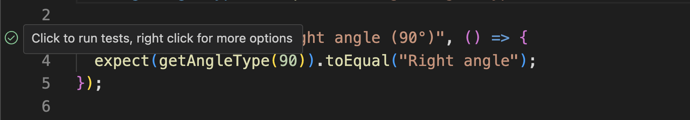
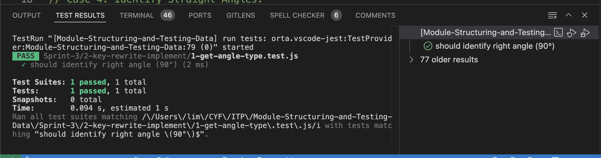

# Implement solutions and rewrite tests with Jest

## 1 Implement solutions

In the `implement` directory you've got a number of functions you'll need to implement.
For each function, you also have a number of different cases you'll need to check for your function.

Write your assertions and build up your program case by case. Don't rush to a solution. The point of these assignments is to learn how to write assertions and build up a program step by step.

Here is a recommended order:

1. `1-get-angle-type.js`
2. `2-is-proper-fraction.js`
3. `3-get-card-value.js`

## 2 Rewrite tests with Jest

`console.log` is most often used as a debugging tool. We use to inspect the state of our program during runtime.

We can use `console.assert` to write assertions: however, it is not very easy to use when writing large test suites. In the first section, Implement, we used a custom "helper function" to make our assertions more readable.

Jest is a whole library of helper functions we can use to make our assertions more readable and easier to write.

Your new task is to write the same tests as you wrote in the `implement` directory, but using Jest instead of `console.assert`.

You shouldn't have to change the contents of `implement` to write these tests.

There are files for your Jest tests in the `rewrite-tests-with-jest` directory. They will automatically use the functions you already implemented.

You can run all the tests in this repo by running `npm test` in your terminal. However, VSCode has a built-in test runner that you can use to run the tests, and this should make it much easier to focus on building up your test cases one at a time.

https://code.visualstudio.com/docs/editor/testing

1. Go to rewrite-tests-with-jest/1-get-angle-type.test.js
2. Click the green play button to run the test. It's on the left of the test function in the gutter.
3. Read the output in the TEST_RESULTS tab at the bottom of the screen.
4. Explore all the tests in this repo by opening the TEST EXPLORER tab. The logo is a beaker.

> [!TIP]
> You can always run a single test file by running `npm test path/to/test-file.test.js`.
